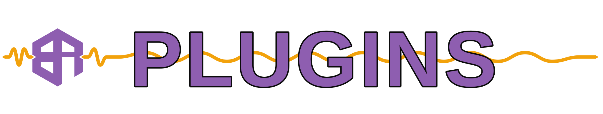

  

**Every Box Of Rules plugin, one download shelf.** Digitally Analogue: built from our own studio captures, real cabs, real mics, real rooms. You'll hear Box Of Rules plugins on Box Of Rules songs.

Each release here is one plugin at one version, tagged `<plugin>-v<version>`, with the installers for macOS, Windows and Linux attached. The plugin pages at [plugins.boxofrules.com](https://plugins.boxofrules.com?utm_source=github&utm_medium=readme&utm_campaign=plugins) link straight to these files and keep the docs, FAQ and presets beside them. Most of our plugins are free. The supporter ones say so on their page.

## Plugins

Plugins appear here as their releases move across from the older per-plugin repos.

## Links

- Plugin pages, docs and presets: [plugins.boxofrules.com](https://plugins.boxofrules.com?utm_source=github&utm_medium=readme&utm_campaign=plugins)
- The music: [boxofrules.com](https://boxofrules.com?utm_source=github&utm_medium=readme&utm_campaign=plugins)
- Keep it coming: [boxofrules.com/support](https://boxofrules.com/support?utm_source=github&utm_medium=readme&utm_campaign=plugins)
